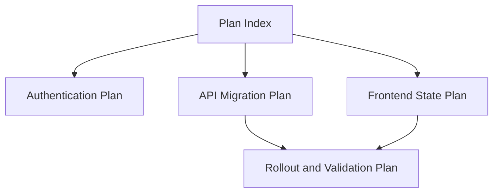

# Repo Plan

## Overview

Use this skill to write, review, or revise repo-grounded plans that another engineer can execute later without rediscovering the context. This is a planning-only skill: inspect the repository as needed, but do not implement, code, refactor, migrate, test-fix, or otherwise perform the planned work. Write and revise outputs as Markdown files in the repository root's `plans/` directory unless the repo already has a clearly established equivalent convention. Review outputs are findings in chat unless the user explicitly asks to update or save a document.

## Planning-Only Boundary

- Write or update plan documents only. Do not modify source code, tests, migrations, configuration, package manifests, lockfiles, assets, generated files, or product documentation outside the plan location.
- Do not begin implementation after writing the plan unless the user makes a separate explicit implementation request.
- Do not create stubs, scaffolds, feature flags, TODO comments in code, migrations, test files, or placeholder implementation files as part of this skill.
- Do not run commands that intentionally write non-plan files, such as code generators, formatters, dependency installers, migrations, or project repair scripts.
- Treat builds, tests, linters, migrations, rollout checks, and manual QA as future validation to document in the plan, not as implementation validation to run now.
- If active repository instructions require branch, tracker, or issue bookkeeping for any repository edit, keep that bookkeeping scoped to the plan-writing task and do not convert it into implementation work.

## Mode Selection

- **Write Mode**: Use when the user asks to create, draft, write, save, split, break down, diagram, sketch, or maintain a plan. Create or update plan documents in `plans/`.
- **Review Mode**: Use when the user asks to review, audit, check, evaluate, critique, or assess an existing plan. Do not edit files by default. Report findings in chat with file/line references when possible.
- **Revise Mode**: Use when the user explicitly asks to apply feedback, update, rewrite, clean up, reorganize, or revise an existing plan document. Edit only plan files and required plan-task bookkeeping.

If the request mixes review and revision, review first and revise only when the user clearly asked for document changes in the same request.

## Shared Workflow

1. Locate the repository root with `git rev-parse --show-toplevel`. If there is no repo root and the user did not provide a path, ask for the repository path before writing files.
2. Follow active user, developer, and repository instructions for the plan task. If those instructions require a branch, tracker entry, issue sync, or scoped staging, keep it narrowly tied to writing or revising the plan.
3. Inspect the repo read-only before writing, reviewing, or revising:
   - Read existing `plans/` documents to learn naming, heading, and status conventions.
   - Read relevant tracker files, README/docs, architecture notes, tests, and source files for the requested area.
   - Use `rg --files` and targeted `rg` searches before broader reads.
4. Choose the mode from the user request, then follow the matching section below.

## Write Mode

1. Size the scope before choosing the output shape. If the request is too broad for one executable plan, split it into smaller scopes instead of forcing everything into one document.
2. Choose whether a visual companion would reduce ambiguity. Include one when it clarifies structure, order, state, dependencies, data flow, rollout, or UI layout.
3. Create `plans/` at the repository root if it does not exist. If an existing plan already covers the same scope, update it unless the user explicitly asked for a new document.
4. Name new files with the existing convention. If none exists, use `YYYY-MM-DD-short-topic.md` with the current environment date and a lowercase hyphenated slug.
5. Write each plan as a repository artifact, not a chat transcript. Be specific, cite local files or modules, distinguish verified facts from assumptions, and keep all implementation work as proposed future steps.
6. Validate the plan document or document set only, then report the created or updated paths and any document validation that was or was not run.

## Review Mode

Review an existing plan against the repo and the quality bar below. Do not edit files unless the user explicitly asks for revision.

Lead with findings, ordered by severity. For each finding, include the plan file and line number when possible, explain the risk, and describe the concrete improvement. Focus on:

- Scope that is too broad, too vague, duplicated, or mixed across unrelated workstreams.
- Missing or weak objective, background, non-goals, current state, proposed approach, implementation steps, validation plan, rollout/backout, risks, open questions, or completion criteria.
- Implementation creep, such as source edits, test creation, migrations, generator runs, or non-plan file changes embedded in the planning task.
- Validation commands that do not match the repo, are invented, are too expensive for the scope, or omit likely required checks.
- Risks that lack mitigations, rollout steps that lack a backout, or open questions that should be answered before implementation.
- Visual companions that are missing when they would clarify the plan, or visuals that are decorative, misleading, or mismatched to the work.
- Child-plan splits that create unclear ownership, hidden dependencies, or scopes that cannot be implemented and validated independently.

If no issues are found, say that clearly and mention any residual uncertainty from repo areas that were not inspected.

## Revise Mode

Revise only plan files and required plan-task bookkeeping. Preserve useful existing context, comments, references, and repo-specific conventions. Prefer small, reviewable edits over rewriting the entire document unless the plan is structurally unsalvageable or the user asked for a rewrite.

When applying review feedback:

1. Re-read the target plan and relevant repo evidence.
2. Update scope, structure, visual companions, validation, risks, rollout/backout, or completion criteria as needed.
3. Keep all implementation work as future proposed steps.
4. Validate the changed plan document only.
5. Report the updated path, the main planning changes, and any document validation that was or was not run.

## Scope Sizing

Use one plan when the work has one coherent objective, one primary owner area, and one validation path. Break the work into smaller scopes when the plan would otherwise mix unrelated objectives, touch multiple major subsystems, require different rollout strategies, or produce implementation steps that cannot be reviewed independently.

When scope is too big, choose one of these output shapes:

- **Index plus child plans**: Create one overview plan, such as `YYYY-MM-DD-topic-plan-index.md`, and separate child plans for each scope. Use this when several workstreams need shared context, ordering, dependencies, or coordinated rollout.
- **Separate standalone plans**: Create multiple self-contained plan files. Use this when the scopes are independent and can be assigned, implemented, validated, and shipped separately.
- **Phased single plan**: Keep one document with clear phases only when the work is sequential and the same context, files, and validation strategy apply throughout.

For an index plan, include:

```markdown
# <Program or Initiative> Plan Index

Date: YYYY-MM-DD
Status: Draft
Repository: <repo name>

## Objective
State the larger outcome.

## Scope Breakdown
- <Child plan title>: <one-sentence scope and path to the child plan>

## Recommended Order
Describe dependencies and sequencing.

## Shared Context
Capture facts, constraints, and risks that apply to every child plan.

## Cross-Cutting Validation
List validation that only makes sense after multiple child plans land.

## References
List local files, issues, docs, prior plans, and commands used as evidence.
```

For child plans, use the standard plan structure and keep each scope small enough that its implementation steps can be completed and validated without silently depending on unrelated child plans.

Before writing multiple files, make a reasonable split and proceed unless the split changes product direction, creates unclear ownership, or would require user prioritization. In those cases, ask a concise question before writing.

## Plan Document Structure

Use the repo's existing plan template when one exists. Otherwise use this structure, deleting sections that genuinely do not apply:

```markdown
# <Specific Plan Title>

Date: YYYY-MM-DD
Status: Draft
Repository: <repo name>
Request: <one-sentence summary of the user's request>

## Objective
State the outcome the plan is meant to achieve and why it matters.

## Background
Summarize the relevant repo context discovered from code, docs, tests, issues, and prior plans.

## Scope
List the work included in this plan.

## Non-Goals
Name related work that should stay out of scope.

## Current State
Describe the existing behavior, architecture, files, data flow, or process.

## Proposed Approach
Explain the recommended direction and key design decisions.

## Visual Companion
Embed the chosen Mermaid diagram or low-fidelity sketch when it reduces ambiguity. Omit this section when no visual is useful.

## Implementation Steps
- [ ] Write concrete, ordered steps that can be executed and reviewed independently.

## Files and Modules
List likely files, directories, commands, services, schemas, or interfaces involved.

## Data, API, UX, or Compatibility Impact
Cover only the categories relevant to the repo and task.

## Validation Plan
List specific tests, builds, linters, manual checks, migrations, or monitoring that future implementation work should run.

## Rollout and Backout
Describe release sequencing, feature flags, migration safety, and rollback steps when relevant.

## Risks and Mitigations
Pair each meaningful risk with a practical mitigation.

## Open Questions
Capture only questions that remain after reasonable repo inspection.

## Completion Criteria
Define what proves the future planned work is done. Separately make clear that this document only completes the planning step.

## References
Link or list local files, issues, docs, prior plans, and commands used as evidence.
```

## Visual Companions

Prefer visuals that are easy to review in git. Use Mermaid diagrams inside the Markdown plan by default. Use ASCII wireframes for rough UI sketches. Use generated images, Figma, or separate diagram files only when the user explicitly requests a polished visual artifact or the repository already has that convention.

Choose the visual type that answers the biggest planning question:

- **Architecture map**: Use when the plan touches modules, packages, services, dependencies, integrations, storage, or boundaries. Prefer `flowchart`.
- **Sequence diagram**: Use when order matters, such as request handling, auth, sync, checkout, background jobs, notifications, retries, or handoffs. Prefer `sequenceDiagram`.
- **State diagram**: Use when something moves through statuses, such as onboarding, subscriptions, uploads, approvals, jobs, errors, or retry handling. Prefer `stateDiagram-v2`.
- **Dependency graph**: Use when scope is split into child plans or workstreams depend on each other. Prefer `flowchart`.
- **Timeline or phased rollout**: Use when sequencing, migration, release safety, feature flags, staged delivery, or backout matters. Prefer Mermaid `timeline`, `gantt`, or a compact Markdown table.
- **Data flow diagram**: Use when data is created, transformed, stored, synced, exported, imported, or displayed. Prefer `flowchart`.
- **Low-fidelity UI sketch**: Use when the plan touches screens, navigation, forms, dashboards, settings, empty states, or user workflows. Prefer an ASCII sketch or a Mermaid screen-flow diagram.

If multiple visuals apply, include the one that removes the most ambiguity. Add a second visual only when it clarifies a different risk or decision. If no visual improves the plan, omit it; do not add decorative diagrams.

Example dependency graph for an oversized scope:



Example low-fidelity UI sketch:

```text
Settings Screen

+------------------------------------------------+
| Header: Settings                         Save  |
+------------------------------------------------+
| Profile                                        |
| +--------------------------------------------+ |
| | Avatar   Name input                        | |
| |          Email input                       | |
| +--------------------------------------------+ |
| Notifications                                  |
| [x] Email updates                              |
| [ ] Push notifications                         |
| Danger Zone                                    |
| +--------------------------------------------+ |
| | Delete account                      Delete | |
| +--------------------------------------------+ |
+------------------------------------------------+
```

## Quality Bar

- Prefer absolute dates in metadata and relative repo paths inside the plan.
- Make implementation steps actionable enough that they can become tracker tasks.
- Let the plan choose the right visual companion when useful; do not ask the user unless the visual changes product direction or the scope split needs prioritization.
- Include future validation commands that match the repo's actual toolchain; do not invent commands when the repo gives no evidence, and do not run those commands as implementation proof during this planning-only task.
- Record assumptions explicitly instead of hiding uncertainty in confident language.
- Keep `Open Questions` short. If a missing answer blocks a credible plan, ask the user before writing.
- Avoid broad refactor ideas unless the request or repo evidence justifies them.
- Do not mark the underlying implementation complete just because the plan document is complete. If a tracker entry was added for writing the plan, mark only that plan-writing task complete after validation.

## Validation

After writing or updating the plan:

1. Re-open the file and check that the title, date, status, scope, steps, validation plan, risks, and completion criteria are present.
2. Search the new or changed plan for unresolved placeholders such as `[TODO]`, `[placeholder]`, or template-only text.
3. If the plan includes Mermaid, visually inspect the syntax for obvious broken node labels, unclosed quotes, or unsupported diagram blocks.
4. Run the repo's existing Markdown/documentation formatter or linter only if one is already configured, cheap to run, and does not modify non-plan files.
5. Review `git diff -- plans/` and any required tracker file touched to ensure the change is scoped to the plan-writing task and contains no implementation.
